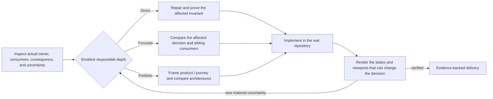

# Snowe UI Skill

[](https://github.com/What0ff/snowe-ui-skill/actions/workflows/ci.yml)
[](LICENSE)
[](https://www.python.org/)

Snowe is a consequence-calibrated design skill for Codex and compatible `SKILL.md` runtimes. It keeps bounded corrections local, widens shared-system work only to affected consumers, and opens full product or journey architecture only when material uncertainty warrants it. For open work, it helps an agent frame the real product and business problem, synthesize materially different experience directions, choose through causal evidence, implement in the target repository, and improve the result through rendered critique.

It is not a layout, style, or landing-page recipe chooser. The remaining optional local evidence catalogs support explicit retrieval and analogy; they do not classify the brief or define the solution space.

> Snowe UI Skill is an independent community project. It is not affiliated with or endorsed by OpenAI.

## Flagship rendered forward-test — Goodturn Cycles

The flagship rendered forward-test is a fictional Bucharest city-bike workshop developed by applying Snowe's architecture-first workflow. Its checked-in decisions, implementation, screenshots, and browser states demonstrate one authored outcome; they do not isolate Snowe as the cause or predict another agent run.


The site presents all three products and prices before asking for interaction. Visitors can inspect the range directly, compare models, use an optional three-question finder, reserve a starting size for a refundable €50 hold, or book a free test ride.

| Product field | Guided choice |
| --- | --- |
|  |  |

The layout changes its composition at pressure and narrow widths while preserving price, fit, ownership evidence, and the next action.

<p align="center">
  
  
</p>

Important product decisions remain usable as real states, not presentation-only mockups.

| Comparison | Mobile product sheet |
| --- | --- |
|  |  |

Goodturn, its bikes, prices, policies, address, and imagery are fictional benchmark content. The product and campaign images were generated and art-directed for this forward-test; they do not represent real products.

- [Open the benchmark](benchmarks/bicycle-commerce/README.md)
- [Read the accepted causal decisions](benchmarks/bicycle-commerce/design-intelligence/goodturn-cycles/DECISIONS.md)
- [Read the candidate comparison](benchmarks/bicycle-commerce/design-intelligence/goodturn-cycles/CANDIDATES.md)
- [Read the rendered QA and corrections](benchmarks/bicycle-commerce/design-intelligence/goodturn-cycles/QA.md)
- [Browse all screenshots](benchmarks/bicycle-commerce/screenshots)

## Flagship expressive-motion showcase — Doppler Soda

Doppler is a fictional carbonated soft-drink campaign where rich motion is justified by the product itself: carbonation pressure, a cylindrical aluminum package, and flavor change all need one continuous physical carrier. The dependency-free CSS-3D can enters with a finite release, responds to pointer and keyboard rotation, then completes a controlled turn when visitors tune one of three named flavors; the rest of the page stays deliberately still.

### [Open the live interactive Doppler experience →](https://what0ff.github.io/snowe-ui-skill/)


| Wide flavor state | Mobile product state |
| --- | --- |
|  |  |

Doppler, its packaging, flavors, price, and campaign are fictional. Its can, labels, and graphics are original code-native assets; no AI-generated imagery is used. The animation and stills were captured from the final local browser implementation, not fabricated separately.

- [Open the Doppler benchmark](benchmarks/soda-campaign/README.md)
- [Read the selected architecture and causal decisions](benchmarks/soda-campaign/design-intelligence/DECISIONS.md)
- [Read the motion implementation comparison](benchmarks/soda-campaign/design-intelligence/MOTION.md)
- [Read the rendered QA and corrections](benchmarks/soda-campaign/design-intelligence/QA.md)
- [Read why expression was justified here but rejected elsewhere](benchmarks/CROSS-BENCHMARK.md#expressive-motion-companion)

## Rendered coverage — three additional experience classes

Goodturn is the flagship, not the only rendered regression. Three additional forward-tests begin from different actors, objects, stakes, content, and repeat-use conditions. None uses generated imagery or a custom asset because those choices do not improve the work; municipal and warehouse motion is limited to necessary state feedback, while the publication uses only reading progress. Together, these four non-motion-focused implementations cover four materially different authored classes; Doppler adds a fifth expressive-motion regression. They do not prove universal performance, automated aesthetic quality, or causal model improvement.

| Experience | Causal architecture | Interaction posture |
|---|---|---|
| Larkhaven public service | One request journey through eligibility, evidence, application, recovery, status, and assisted service | Plain-language forms, bilingual state, error summary, visible service progress |
| Relay North operations | Persistent application shell around exception queue, affected object, history, and audited resolution | Dense records, stable inspector, search/filter, J/K/E and slash keyboard paths |
| The Morrow Review | Issue relationships flowing into sustained reading, contents, editorial context, archive, then earned membership | Typographic navigation, reading controls, saved state, archive discovery |

### Representative desktop and mobile states

Each pair keeps a desktop interaction large enough to inspect while retaining one narrow-state transformation. Open an image for its full-resolution capture.

#### Larkhaven — eligibility before application

<p align="center">
  <a href="benchmarks/forward-tests/municipal-service/screenshots/desktop-result.jpg"></a>
  <a href="benchmarks/forward-tests/municipal-service/screenshots/mobile-status-dialog.jpg"></a>
</p>

#### Relay North — live queue and audited resolution

<p align="center">
  <a href="benchmarks/forward-tests/warehouse-operations/screenshots/desktop-queue.jpg"></a>
  <a href="benchmarks/forward-tests/warehouse-operations/screenshots/mobile-resolution.jpg"></a>
</p>

#### The Morrow Review — sustained reading and issue navigation

<p align="center">
  <a href="benchmarks/forward-tests/literary-publication/screenshots/desktop-reading.jpg"></a>
  <a href="benchmarks/forward-tests/literary-publication/screenshots/mobile-contents.jpg"></a>
</p>

The transformations remain causally different: the service becomes one evidence order, the operations table becomes structured records with an on-demand rail, and the editorial spread becomes a continuous authored reading flow.

- [Open the rendered forward-tests](benchmarks/forward-tests/README.md)
- [Read the cross-benchmark causal comparison](benchmarks/CROSS-BENCHMARK.md)
- [Inspect the local evidence audit](evals/designer-behavior/EVIDENCE-AUDIT.md)

## What Snowe changes

Snowe gives the agent freedom to invent a solution absent from local patterns, while making that freedom accountable:

- the actual owner, affected invariant, consumers, and consequence determine the smallest responsible process; whole-journey framing is reserved for live whole-system uncertainty;
- high-leverage choices use a causal record: `driver → design move → expected consequence → evidence → risk → revisit trigger`;
- site/page candidates differ in topology, navigation, sequence, disclosure, interaction, or conversion—not only visual tokens;
- art direction is derived from the product's real objects, content, workflow, audience, language, and place;
- external research is targeted at decisions it can change and stops when evidence is sufficient;
- `No image`, `No custom asset`, and `No animation` are valid outcomes;
- generated imagery is art-directed for the actual crop and rejected when it weakens truth or composition;
- custom graphics have a drawing language, provenance, structural validation, target-size comparison, and a rejection path;
- motion starts from a complete static/reduced-motion experience and exists only for hierarchy, continuity, explanation, feedback, or character that earns its cost;
- accessibility, content resilience, responsive behavior, localization, interaction quality, and performance remain design invariants;
- evaluation uses rendered `KEEP | REVISE | REJECT | UNKNOWN` evidence rather than a numeric creativity score.

## How it works



Snowe scales the inquiry to the consequence:

- **Direct** for a bounded invariant inside a coherent system, including a narrow high-consequence correction when the owner and answer are known. Consequence raises the proof floor without automatically widening the process.
- **Focused** for one material choice or a local symptom owned by a shared mechanism inside an established product.
- **Portfolio** only when inspection reveals material uncertainty in goals, topology, journey, content relationships, interaction, responsive transformation, or system contracts.

Specialist references are loaded only when the decision needs them. A project does not execute every workflow as a checklist.

## Repository structure

```text
snowe-ui-skill/
├── AGENTS.md                           # Repository-wide contributor/agent guide
├── CONTRIBUTING.md                     # Human contribution workflow
├── .agents/skills/atlas-maintainer/     # Repository-only context maintenance workflow
├── docs/atlas/                         # Durable public architecture and task router
├── skill/snowe-ui-skill/             # Installable product
│   ├── SKILL.md                       # Core workflow and reference router
│   ├── agents/openai.yaml             # Skill interface metadata
│   ├── data/                          # Optional local evidence catalogs
│   ├── references/                    # Progressive specialist guidance
│   └── scripts/
│       ├── search.py                  # CLI entrypoint
│       ├── core.py                    # BM25 retrieval and evidence roles
│       ├── decision_packet.py         # Portfolio/open-inquiry packet and persistence
│       ├── asset_quality.py           # SVG structure/provenance validation
│       ├── icon_review.py             # Self-contained icon decision comparison
│       └── contrast.py                # Exact opaque-color contrast checks
├── evals/designer-behavior/           # Deterministic cross-business contracts
├── evals/icon-decisions/               # Existing/custom/no-icon operational proof
├── benchmarks/bicycle-commerce/       # Rendered Goodturn forward-test
├── benchmarks/soda-campaign/           # Expressive Doppler motion benchmark
├── benchmarks/forward-tests/           # Public-service, operations, and editorial evidence
├── scripts/
│   ├── atlas/generate_atlas.py          # Deterministic public repository map
│   ├── check_contributor_context.py     # Public/private boundary validation
│   ├── install_skill.py                # Exact standalone install/update helper
│   └── browser-smoke.mjs               # Dependency-free Chrome/CDP browser checks
└── tests/                             # Product and benchmark regression suite
```

Repository documentation, evaluations, benchmarks, and development tooling stay outside the installable skill directory. A fresh clone includes the durable contributor context above; maintainer-local checkpoints, logs, working output, and personal AI configuration remain ignored and are never required for contribution.

## Installation

[Current Codex documentation](https://developers.openai.com/codex/skills/) loads user-authored standalone skills from `$HOME/.agents/skills` and supports installing skills from other repositories through `$skill-installer`. Snowe is currently distributed as one standalone skill, not as a plugin.

### Install through Codex

Ask the built-in installer:

```text
Use $skill-installer to install skill/snowe-ui-skill from https://github.com/What0ff/snowe-ui-skill.
```

### Reproducible clone, install, and update

The repository installer uses only Python 3.11+ standard-library modules. It requires a self-contained regular source tree, serializes concurrent swaps with an OS lock, stages a complete copy beside the destination, revalidates that staged tree immediately before activation, preserves an interrupted previous tree until staging succeeds, revalidates the activated destination before reporting success, replaces obsolete files instead of nesting directories, and restores the previous install if activation fails. Destination symlinks, Windows junctions, and other reparse points are rejected; Windows short names are expanded without resolving redirect targets, and both lexical spellings are checked before locking or mutation. An existing final path is replaced only when it is a fully regular Snowe install whose `SKILL.md` frontmatter declares `name: snowe-ui-skill`; an unrecognized file, directory, or different skill is refused untouched. Fixed-name transient paths without current-run ownership are preserved by quarantine instead of recursively deleted, and cleanup is bound to the transient filesystem identity.

On Windows:

```powershell
git clone https://github.com/What0ff/snowe-ui-skill.git
python .\snowe-ui-skill\scripts\install_skill.py
```

On macOS or Linux:

```bash
git clone https://github.com/What0ff/snowe-ui-skill.git
python3 snowe-ui-skill/scripts/install_skill.py
```

Update the clone and rerun the same installer; repeated runs replace the destination exactly:

```bash
git -C snowe-ui-skill pull --ff-only
python3 snowe-ui-skill/scripts/install_skill.py
```

Use `--destination /path/to/skills/snowe-ui-skill` for another compatible runtime. The destination must be the final `snowe-ui-skill` directory. Codex normally detects skill changes automatically; restart it if the updated skill does not appear.

If an older Snowe version was copied to `~/.codex/skills/snowe-ui-skill`, verify the new `.agents/skills` install and then remove or disable the legacy copy yourself. The installer intentionally does not delete a legacy location that may contain user changes; keeping both can expose duplicate skill names.

## Usage

Invoke the skill from a real design/build request:

```text
Use $snowe-ui-skill to design and build a new commerce experience from product truth through rendered QA.

Use $snowe-ui-skill to rethink this service's information architecture and navigation before changing its visual system.

Use $snowe-ui-skill to review this existing product, preserve what works, and fix the most consequential UX and visual-quality failures.

Use $snowe-ui-skill to correct this one component's spacing and render the affected state; keep the intervention local unless inspection exposes a shared owner or material contract uncertainty.
```

The skill can design or critique web, mobile, and desktop experiences; establish site/page architecture and navigation; create art direction and design systems; decide typography, color/material, imagery, custom graphics, icons, motion, interactions, and responsive behavior; implement the result; and run rendered review.

## Local decision support

The Python runtime uses the standard library and makes no network request. Its retrieval results now state their evidence role and limitation.

Search one evidence domain:

```bash
python skill/snowe-ui-skill/scripts/search.py \
  "bicycle fit comparison" --domain product --max-results 5
```

`--domain` is required for catalog retrieval. Current domains are `chart`, `product`, `ux`, `icons`, `icon-families`, `icon-concepts`, `icon-candidates`, `react`, `web`, and `google-fonts`; stack guidance uses the separate `--stack` option.

For a Portfolio/open-inquiry task, open a decision packet without selecting a layout, style, palette, font, image, or motion recipe. Direct corrections skip this packet, and ordinary Focused work uses a compact affected-decision record:

```bash
python skill/snowe-ui-skill/scripts/search.py \
  "Independent city-bike retailer with fit and test rides" \
  --decision-packet \
  --project-name "Goodturn Cycles" \
  --format markdown
```

The packet preserves the brief verbatim. It does not classify brief vocabulary, detect its language, or infer work mode, platform, pressures, or ambiguous domain roles. Those fields remain `UNRESOLVED` unless the caller supplies explicit context; the agent derives pressures later from verified project evidence.

Local product analogs are not retrieved automatically. Request a subordinate lexical lookup only when it can change a live decision:

```bash
python skill/snowe-ui-skill/scripts/search.py \
  "Городской магазин велосипедов с подбором посадки" \
  --decision-packet \
  --analog-query "bicycle retailer fit"
```

Persist the open brief, a durable decision ledger, and an optional page inquiry:

```bash
python skill/snowe-ui-skill/scripts/search.py \
  "Independent city-bike retailer with fit and test rides" \
  --decision-packet --persist \
  --project-name "Goodturn Cycles" \
  --page "home" \
  --output-dir /path/to/project
```

Persistence requires the explicit `--project-name` identity and writes under `design-intelligence/<project>/`: `PROJECT.json` binds that identity to the slug, one project lock serializes manifest, brief, ledger, and page publication, `BRIEF.md` is atomically regenerated from the current packet, `DECISIONS.md` is created only when absent and then preserved byte-for-byte, and `--page` adds or atomically refreshes an identity-checked page inquiry without prescribing a page type or section order. Page identity and parent-directory checks run before BRIEF publication and again immediately before page publication. Windows short/long aliases share one lexical root and lock identity without resolving redirects. Slug collisions, Windows-reserved identities, symlink/junction/reparse paths, and shared-hardlink PROJECT/DECISIONS files are refused rather than overwritten.

`--design-system` remains a compatibility alias for `--decision-packet`; it no longer invokes the removed recipe generator. See `python skill/snowe-ui-skill/scripts/search.py --help` for all domains and stacks.

For a material custom-icon decision, validate exact SVG structure/provenance and generate a self-contained existing/custom/no-icon comparison before inspecting the winner and closest rejected alternative in the real host component:

```bash
python skill/snowe-ui-skill/scripts/asset_quality.py \
  path/to/icon.svg --metadata path/to/icon.metadata.json
python skill/snowe-ui-skill/scripts/icon_review.py \
  path/to/manifest.json --output path/to/comparison.html --json
```

The [checked icon decision proof](evals/icon-decisions/README.md) demonstrates all three valid outcomes: an existing glyph wins, custom work wins, and visible text/no icon wins. Structural validation and browser rendering do not certify recognition, optical balance, metaphor, or taste.

## Optional local evidence

The remaining optional local evidence catalogs include caller-requested product analog terms, Google Fonts metadata, UX and web implementation guidance, chart guidance, stack-specific references, icon families/concepts, and curated icon candidates.

These records can expand vocabulary, reveal alternatives, provide counterexamples, or route current research. They are not product classification, current market truth, conversion proof, or an authoritative list of allowable designs. Chart retrieval intentionally withholds the bundled snapshot's unsupported exact volume thresholds, threshold-bearing use/avoid prose, palette values, accessibility grades, library recommendations, and interaction prescriptions; returned encoding and accessibility notes remain unsourced prompts until verified against representative data, the target implementation, and primary sources.

Layout, landing, style-combination, palette, typography-pairing, and motion-preset catalogs were removed: even labeled as historical evidence, they encoded ready-made solutions and unsupported suitability claims. Git history preserves the old rows; the installable skill does not return them.

## Evaluation and validation

Run the full regression suite:

```bash
python -m unittest discover -s tests -v
```

Run the deterministic cross-business contract regression:

```bash
python evals/designer-behavior/run_eval.py
```

Compile-check the installable runtime:

```bash
python -m compileall -q skill/snowe-ui-skill/scripts
```

Validate the public contributor-context boundary and structural atlas:

```bash
python scripts/check_contributor_context.py
python scripts/atlas/generate_atlas.py --check
```

Run the dependency-free rendered smoke layer with Node 22 and a local Chrome/Chromium installation:

```bash
node scripts/browser-smoke.mjs --smoke
```

For a bounded Direct/Focused browser check, run only the affected implementation instead of the full portfolio, for example `node scripts/browser-smoke.mjs --smoke --scenario municipal-service`. Supported slugs are `bicycle-commerce`, `soda-campaign`, `municipal-service`, `warehouse-operations`, `literary-publication`, and `icon-decisions`; the unfiltered command remains the canonical full regression.

Repository validation keeps three evidence layers distinct:

- **Deterministic contract regression:** unit tests and `run_eval.py` exercise packet, retrieval, packaging, and authored routing-fixture invariants. They do not invoke a model or observe which references an agent loads.
- **Rendered/browser regression evidence:** five checked-in implementations, captures, decision records, QA notes, the representative icon decision sheet, and browser smoke protect known states and support human comparison. They do not establish that Snowe caused the outcomes or will generalize them.
- **Observed real-agent behavior:** [the bounded 2026-08-23 host probes](evals/designer-behavior/HOST-PROBES.md) record exact tasks, commit, configured model/reasoning, tool context, actual reference loads, process depth, proof, and an honest pre-change control. The sample is small, token totals were unavailable, and repeated model-run variance was not established, so this layer is evidence for these runs only—not causation or generalization.

CI runs compile and unit regressions on Python 3.11/3.13 across Ubuntu and Windows, the deterministic contract regression, the Chrome smoke on Ubuntu and Windows, and a fresh-checkout contributor-context/atlas contract.

- No automated check scores taste or certifies aesthetic quality.
- Browser smoke executes all five rendered benchmarks plus the icon decision comparison and checks for runtime errors, broken assets, horizontal overflow, menu/dialog behavior, focus handoff, critical interactions, responsive states, reduced-motion regressions, declared icon target sizes, exact repository-derived source/selector bindings, and the selected Goodturn/Larkhaven host outcomes.

## Design principles

- Design the right experience before styling the familiar one.
- Freedom comes from live product trade-offs; coherence comes from causal decisions.
- Current external evidence can expand and challenge the local space without becoming a moodboard or copy target.
- Real content, claims, prices, states, crops, and interactions are part of design—not late implementation detail.
- Familiar actions remain recognizable; novelty belongs where it improves identity, comprehension, or experience.
- Rendered consequence matters more than the number of rules, variants, datasets, or gates.

## Contributing

Contributions are welcome. Read the public [repository guide](AGENTS.md) and [contribution workflow](CONTRIBUTING.md), then navigate durable architecture from [the atlas index](docs/atlas/00_README.md). Security issues should follow [SECURITY.md](SECURITY.md).

## License

Snowe UI Skill is available under the [MIT License](LICENSE).

Copyright (c) 2026 What0ff.
