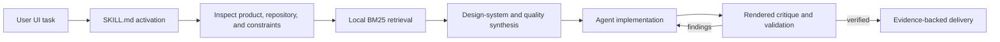

# Snowe UI Skill

[](https://github.com/What0ff/snowe-ui-skill/actions/workflows/ci.yml)
[](LICENSE)
[](https://www.python.org/)

Snowe UI Skill is an evidence-first UI/UX skill for Codex and compatible
`SKILL.md` runtimes. It helps an AI coding agent turn a UI request into a
coherent design direction, an implementation contract, and a rendered,
verifiable result.

The project combines procedural design guidance with a deterministic local
retrieval engine. The guidance tells the agent how to inspect a real product,
compare meaningful alternatives, preserve established systems, implement the
selected direction, and verify the result. The Python tools search a bundled
UI/UX knowledge base and generate structured design-system recommendations.

> Snowe UI Skill is an independent community project. It is not affiliated
> with or endorsed by OpenAI.

## Why it exists

AI-generated interfaces often fail for predictable reasons: they choose a
visual style before understanding the product, repeat generic SaaS patterns,
mix icon languages, treat accessibility as palette metadata, and approve the
result from source code without inspecting the render.

Snowe UI Skill makes the decision process explicit and testable. It asks the
agent to establish product truth, define the relevant option universe, compare
finalists on the same real content, commit to one coherent direction, and run a
bounded rendered critique before delivery.

## What it does

- Designs, reviews, refactors, and polishes web, mobile, and desktop UI.
- Preserves an existing design system unless the requested scope authorizes a
  material change.
- Separates hard invariants from defaults and visual heuristics.
- Runs an art-direction gate for new products, redesigns, and material visual
  changes.
- Provides focused systems for typography, color, shape, iconography, motion,
  layout, interaction states, and accessibility.
- Searches local design guidance with a deterministic BM25 engine.
- Generates design-system recommendations with adjustable variance, motion,
  density, and roundness controls.
- Persists a master design system and scoped page overrides when requested.
- Requires rendered QA at relevant viewports and interaction states.
- Records evidence, rejected alternatives, limitations, and verification work.

## What it does not do

- It does not invent user research, brand rules, test results, or product
  requirements.
- It does not replace visual inspection with static source analysis.
- It does not claim accessibility from colors or screenshots alone.
- The local CLI does not generate application code by itself. It provides
  retrieval, reasoning, and design-system evidence that the agent uses while
  working in the target repository.
- It does not install speculative dependencies during review-only work.

## How it works



1. **Activate** — the runtime matches the task against the description in
   `SKILL.md` and loads the core workflow.
2. **Establish product truth** — the agent inspects the target repository,
   content, platform, design system, brand assets, states, and constraints.
3. **Explore** — for every material decision, the agent declares the candidate
   universe and compares relevant alternatives on the same content.
4. **Retrieve** — the local Python engine ranks relevant records from the
   bundled CSV knowledge base. Runtime search uses the Python standard library
   and makes no network request.
5. **Synthesize** — deterministic rules compose design-system guidance,
   contrast checks, art-direction gates, icon decisions, and critic criteria.
6. **Implement** — the agent extends the target project's architecture and
   existing components rather than scattering one-off styling.
7. **Render and verify** — the agent inspects real layouts and states, fixes
   blocker and major findings, rerenders, and reports executed checks.

## Repository structure

```text
snowe-ui-skill/
├── skill/
│   └── snowe-ui-skill/
│       ├── SKILL.md                 # Activation metadata and core workflow
│       ├── LICENSE                  # License retained with copied installs
│       ├── data/                    # Local UI/UX knowledge base
│       ├── references/              # Progressive-disclosure guidance
│       └── scripts/
│           ├── search.py            # CLI entry point
│           ├── core.py              # BM25 retrieval and domain routing
│           ├── design_system.py     # Recommendation synthesis/persistence
│           └── design_quality.py    # Deterministic quality policies
├── tests/                           # Regression and packaging tests
├── .github/workflows/ci.yml         # Cross-platform test workflow
├── CONTRIBUTING.md
├── SECURITY.md
└── LICENSE
```

Repository documentation and development files live outside the installable
skill folder so they are not loaded into the agent's skill context.

## Knowledge base

The bundled data currently contains:

| Dataset | Records |
| --- | ---: |
| UI styles | 84 |
| Semantic color systems | 192 |
| Typography systems | 74 |
| Product categories | 192 |
| UX guidelines | 99 |
| Chart patterns | 25 |
| Landing-page patterns | 34 |
| Icon families | 10 |
| Icon concepts | 21 |
| Curated icon candidates | 70 |
| Stack-specific guidance | 22 stacks |

Supported stacks include React, Next.js, Vue, Nuxt, Svelte, Astro, Angular,
Laravel, HTML/Tailwind, shadcn/ui, Three.js, SwiftUI, React Native, Flutter,
Jetpack Compose, JavaFX, WPF, WinUI, UWP, Avalonia, and Uno Platform.

## Installation

### Codex on Windows

```powershell
git clone https://github.com/What0ff/snowe-ui-skill.git
Copy-Item -Recurse -Force `
  .\snowe-ui-skill\skill\snowe-ui-skill `
  "$env:USERPROFILE\.codex\skills\snowe-ui-skill"
```

Restart Codex or start a new task so the skill catalog is refreshed.

### Codex on macOS or Linux

```bash
git clone https://github.com/What0ff/snowe-ui-skill.git
mkdir -p "${CODEX_HOME:-$HOME/.codex}/skills"
cp -R snowe-ui-skill/skill/snowe-ui-skill \
  "${CODEX_HOME:-$HOME/.codex}/skills/snowe-ui-skill"
```

For another compatible runtime, copy `skill/snowe-ui-skill/` into that
runtime's skill directory. The folder containing `SKILL.md` is the installable
unit.

## Usage

The skill is designed to activate from natural UI/UX requests. Examples:

```text
Review this React dashboard and fix the usability and visual-quality issues.

Design and implement a responsive onboarding flow for a finance app.

Refactor this settings screen without replacing the existing design system.

Compare icon sources for these domain actions and implement the strongest fit.

Create a design system for a dense desktop analytics workspace, then build it.
```

## Local CLI

Run commands from the installable skill directory:

```bash
cd skill/snowe-ui-skill
```

Search a design domain:

```bash
python scripts/search.py "dense healthcare dashboard" --domain style --max-results 5
```

Search stack-specific guidance:

```bash
python scripts/search.py "accessible validation and focus" --stack react
```

Generate a complete design-system recommendation:

```bash
python scripts/search.py \
  "B2B analytics workspace for expert operators" \
  --design-system \
  --project-name "Operator Console" \
  --format markdown
```

Use bounded design controls when they express a real product decision:

```bash
python scripts/search.py \
  "mobile media editor" \
  --design-system \
  --variance 7 \
  --motion 5 \
  --density 6 \
  --roundness 3
```

Persist a project-wide system and an optional page override:

```bash
python scripts/search.py \
  "commerce operations dashboard" \
  --design-system \
  --persist \
  --project-name "Commerce Ops" \
  --page "orders" \
  --output-dir /path/to/project
```

Use `python scripts/search.py --help` for the complete command reference.

## Design principles

- Product truth before visual direction.
- Same-context comparison before commitment.
- Semantic and visual quality before implementation economics.
- Existing repository conventions as a baseline, not an automatic ceiling.
- One coherent drawing and motion language.
- Accessible semantics, names, focus order, targets, contrast, and reduced
  motion as invariants.
- Real content and edge states instead of placeholder-only review.
- Rendered evidence before approval.
- Bounded critique and correction instead of endless visual churn.

## Development and validation

Requirements:

- Python 3.11 or newer
- No third-party Python runtime dependencies

Run the full regression suite from the repository root:

```bash
python -m unittest discover -s tests -v
```

Compile-check the runtime scripts:

```bash
python -m compileall -q skill/snowe-ui-skill/scripts
```

The current suite covers skill packaging, retrieval, design-system generation,
contrast behavior, icon exploration, typography direction, project memory, and
visual-quality policies.

## Repository hygiene

This repository intentionally excludes machine-specific agent configuration and
runtime state, including `agents/`, `AGENTS.md`, `.codex/`, `.agents/`,
`.openai/`, `CLAUDE.md`, `CODEX.md`, caches, generated output, credentials, and
editor metadata. The installable project contains the skill itself, its local
data, references, runtime scripts, and license.

## Roadmap

- Add a versioned evaluation corpus with repeatable before/after UI tasks.
- Expand rendered QA fixtures across web, mobile, and desktop targets.
- Add machine-readable decision and evidence ledgers.
- Improve dataset provenance, review cadence, and automated validation.
- Add a small installer without coupling the skill to a single agent runtime.
- Publish reproducible quality benchmarks and contribution metrics.

## Contributing

Contributions are welcome. Read [CONTRIBUTING.md](CONTRIBUTING.md) before
submitting a change. Security issues should follow [SECURITY.md](SECURITY.md).

## License

Snowe UI Skill is available under the [MIT License](LICENSE).

Copyright (c) 2026 What0ff.
