# Snowe UI Skill

[](https://github.com/What0ff/snowe-ui-skill/actions/workflows/ci.yml)
[](LICENSE)
[](https://www.python.org/)

Snowe is an architecture-first design skill for Codex and compatible `SKILL.md` runtimes. It helps an agent frame the real product and business problem, synthesize materially different experience directions, choose through causal evidence, implement in the target repository, and improve the result through rendered critique.

It is not a layout, style, or landing-page recipe chooser. The remaining optional local evidence catalogs support explicit retrieval and analogy; they do not classify the brief or define the solution space.

> Snowe UI Skill is an independent community project. It is not affiliated with or endorsed by OpenAI.

## Flagship showcase — Goodturn Cycles

The flagship end-to-end behavioral benchmark is a fictional Bucharest city-bike workshop. Snowe created the positioning, site architecture, three-bike assortment, visual system, imagery strategy, custom icon family, responsive transformations, interaction model, and conversion paths from an open brief.

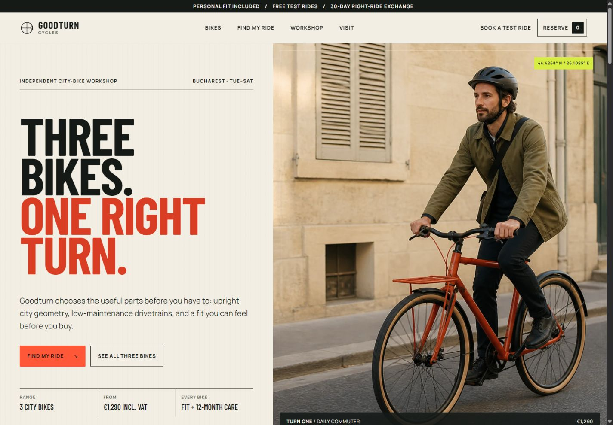

The site presents all three products and prices before asking for interaction. Visitors can inspect the range directly, compare models, use an optional three-question finder, reserve a starting size for a refundable €50 hold, or book a free test ride.

| Product field | Guided choice |
| --- | --- |
| 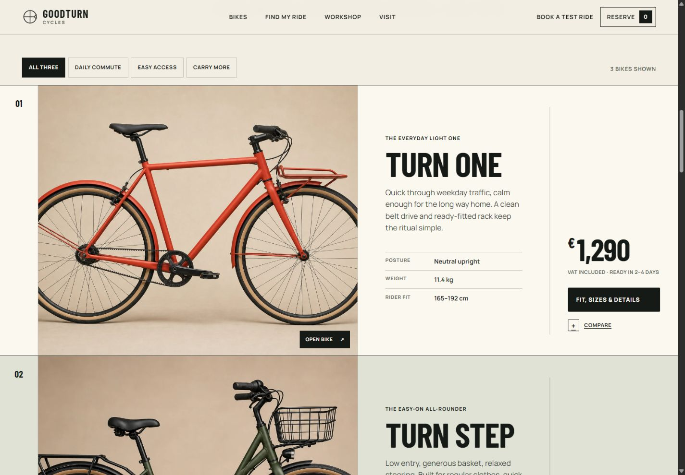 | 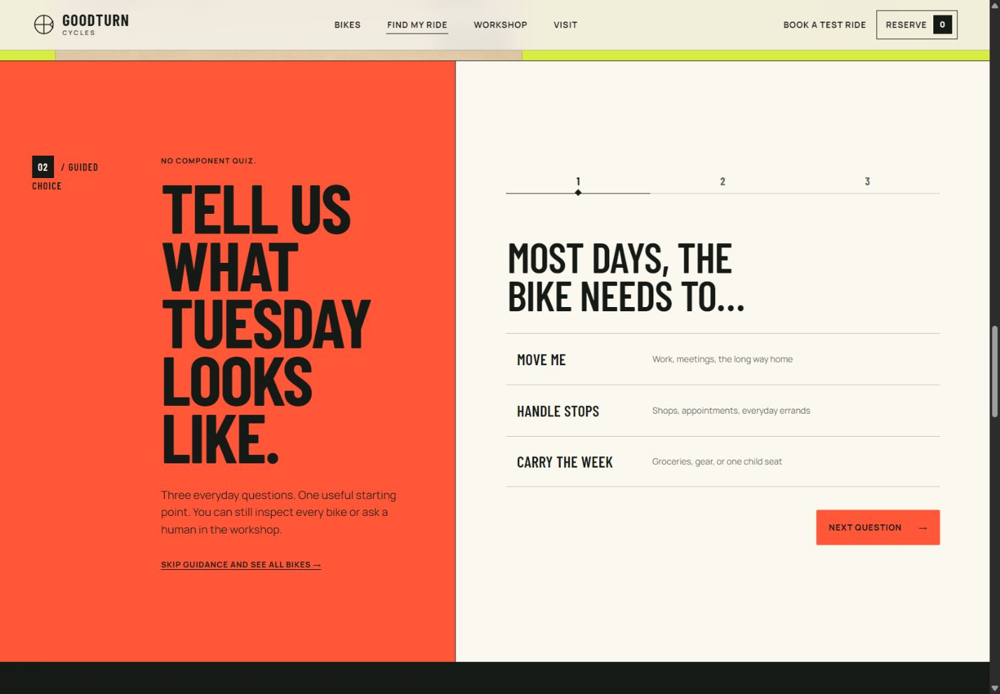 |

The layout changes its composition at pressure and narrow widths while preserving price, fit, ownership evidence, and the next action.

<p align="center">
  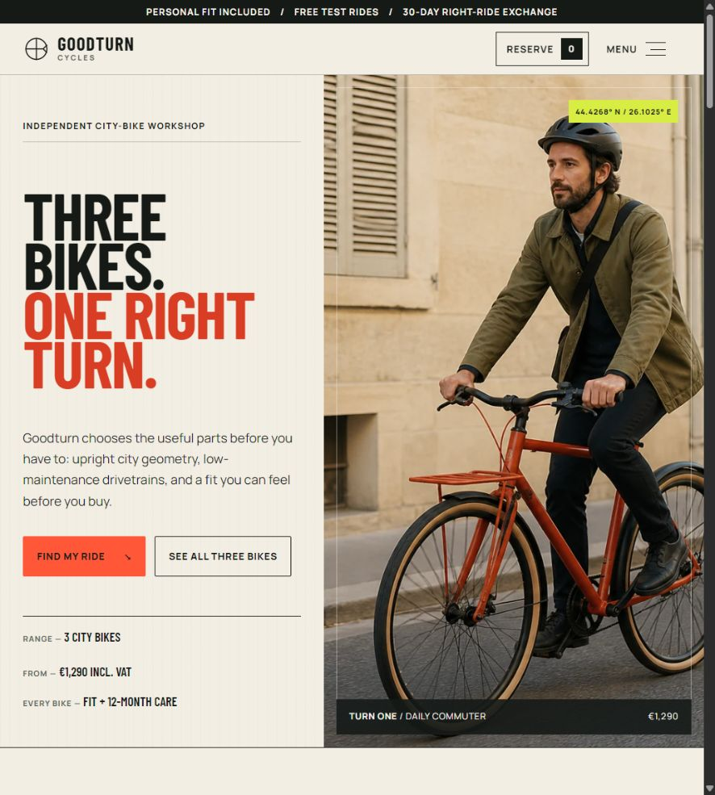
  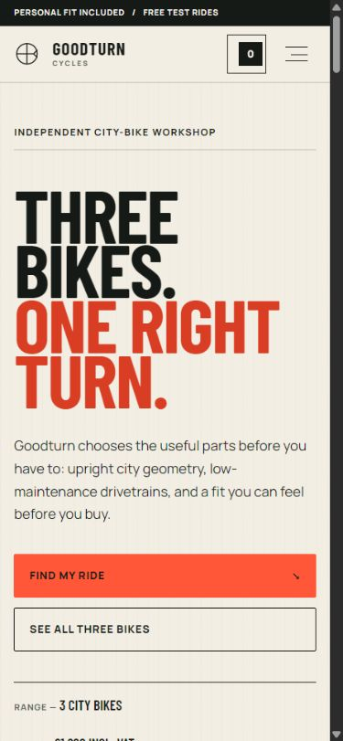
</p>

Important product decisions remain usable as real states, not presentation-only mockups.

| Comparison | Mobile product sheet |
| --- | --- |
| 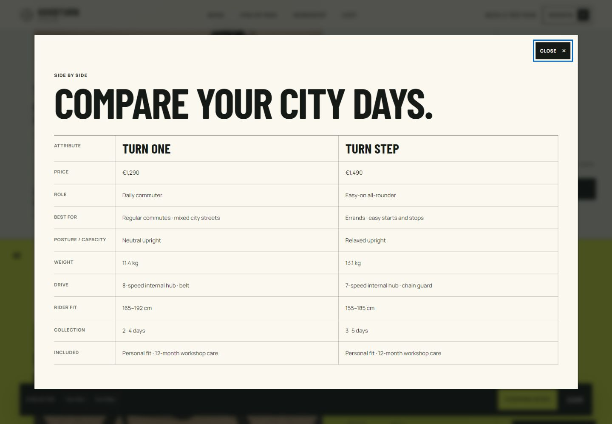 | 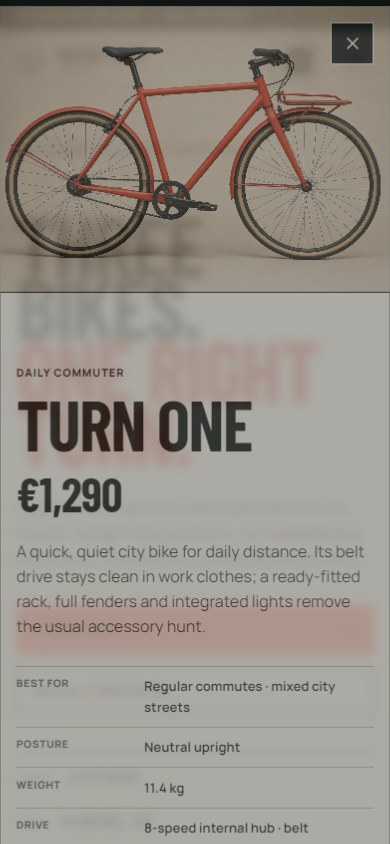 |

Goodturn, its bikes, prices, policies, address, and imagery are fictional benchmark content. The product and campaign images were generated and art-directed for this evaluation; they do not represent real products.

- [Open the benchmark](benchmarks/bicycle-commerce/README.md)
- [Read the accepted causal decisions](benchmarks/bicycle-commerce/design-intelligence/goodturn-cycles/DECISIONS.md)
- [Read the candidate comparison](benchmarks/bicycle-commerce/design-intelligence/goodturn-cycles/CANDIDATES.md)
- [Read the rendered QA and corrections](benchmarks/bicycle-commerce/design-intelligence/goodturn-cycles/QA.md)
- [Browse all screenshots](benchmarks/bicycle-commerce/screenshots)

## Flagship expressive-motion showcase — Doppler Soda

Doppler is a fictional carbonated soft-drink campaign where rich motion is justified by the product itself: carbonation pressure, a cylindrical aluminum package, and flavor change all need one continuous physical carrier. The dependency-free CSS-3D can enters with a finite release, responds to pointer and keyboard rotation, then completes a controlled turn when visitors tune one of three named flavors; the rest of the page stays deliberately still.

### [Open the live interactive Doppler experience →](https://what0ff.github.io/snowe-ui-skill/)


| Wide flavor state | Mobile product state |
| --- | --- |
|  |  |

Doppler, its packaging, flavors, price, and campaign are fictional. Its can, labels, and graphics are original code-native assets; no AI-generated imagery is used. The animation and stills were captured from the final local browser implementation, not fabricated separately.

- [Open the Doppler benchmark](benchmarks/soda-campaign/README.md)
- [Read the selected architecture and causal decisions](benchmarks/soda-campaign/design-intelligence/DECISIONS.md)
- [Read the motion implementation comparison](benchmarks/soda-campaign/design-intelligence/MOTION.md)
- [Read the rendered QA and corrections](benchmarks/soda-campaign/design-intelligence/QA.md)
- [Read why expression was justified here but rejected elsewhere](benchmarks/CROSS-BENCHMARK.md#expressive-motion-companion)

## Rendered generalization evidence — three additional experience classes

Goodturn is the flagship, not the only rendered evidence. Three additional forward-tests begin from different actors, objects, stakes, content, and repeat-use conditions. None uses generated imagery or a custom asset because those choices do not improve the work; municipal and warehouse motion is limited to necessary state feedback, while the publication uses only reading progress. Together, the four benchmarks provide evidence across four materially different tested classes—not proof of universal performance or automated aesthetic quality.

| Experience | Causal architecture | Interaction posture |
|---|---|---|
| Larkhaven public service | One request journey through eligibility, evidence, application, recovery, status, and assisted service | Plain-language forms, bilingual state, error summary, visible service progress |
| Relay North operations | Persistent application shell around exception queue, affected object, history, and audited resolution | Dense records, stable inspector, search/filter, J/K/E and slash keyboard paths |
| The Morrow Review | Issue relationships flowing into sustained reading, contents, editorial context, archive, then earned membership | Typographic navigation, reading controls, saved state, archive discovery |

### Representative desktop and mobile states

Each pair keeps a desktop interaction large enough to inspect while retaining one narrow-state transformation. Open an image for its full-resolution capture.

#### Larkhaven — eligibility before application

<p align="center">
  <a href="benchmarks/forward-tests/municipal-service/screenshots/desktop-result.jpg">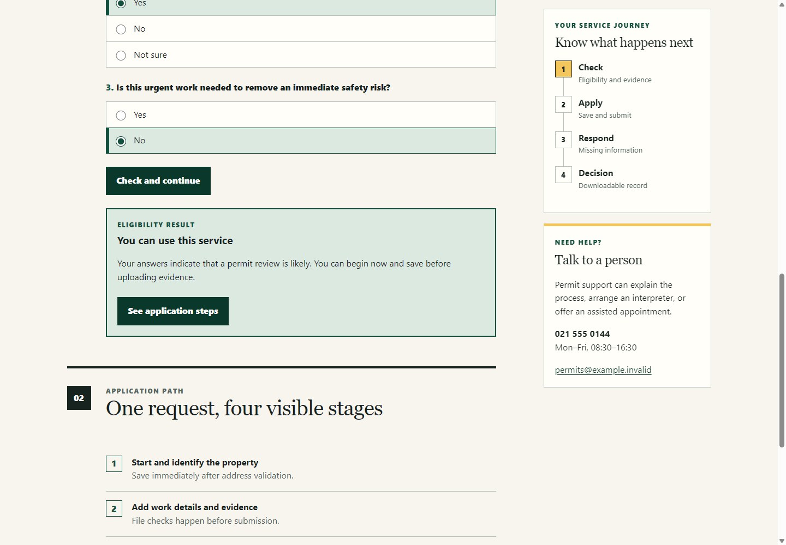</a>
  <a href="benchmarks/forward-tests/municipal-service/screenshots/mobile-status-dialog.jpg">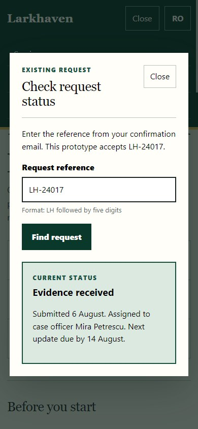</a>
</p>

#### Relay North — live queue and audited resolution

<p align="center">
  <a href="benchmarks/forward-tests/warehouse-operations/screenshots/desktop-queue.jpg">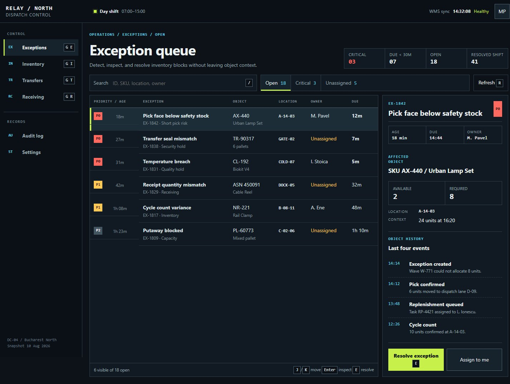</a>
  <a href="benchmarks/forward-tests/warehouse-operations/screenshots/mobile-resolution.jpg">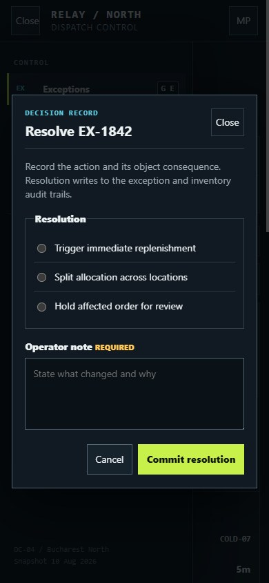</a>
</p>

#### The Morrow Review — sustained reading and issue navigation

<p align="center">
  <a href="benchmarks/forward-tests/literary-publication/screenshots/desktop-reading.jpg">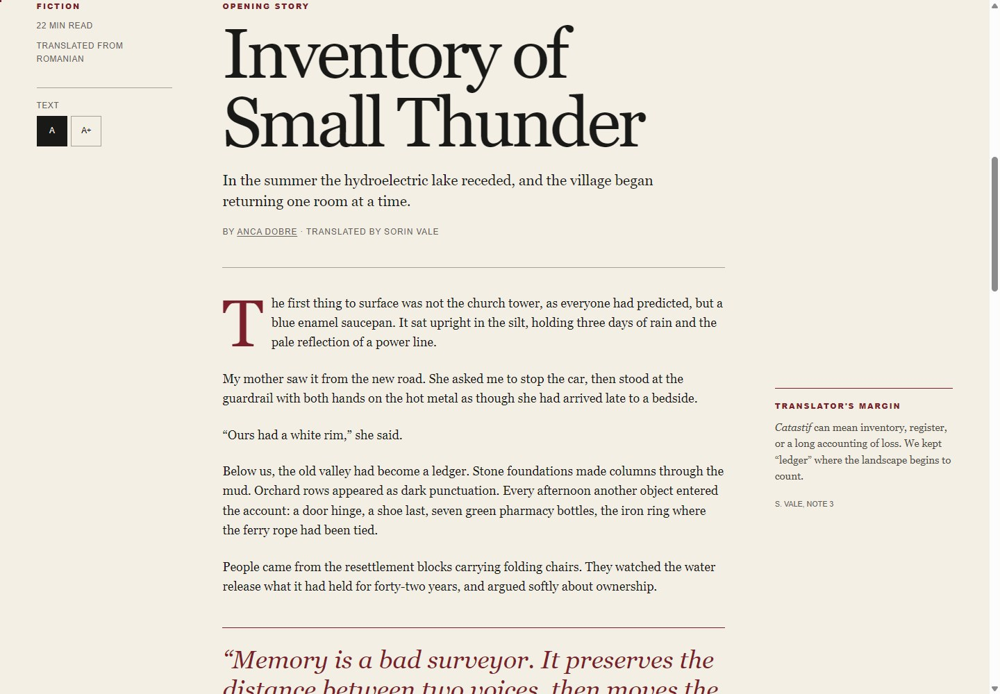</a>
  <a href="benchmarks/forward-tests/literary-publication/screenshots/mobile-contents.jpg">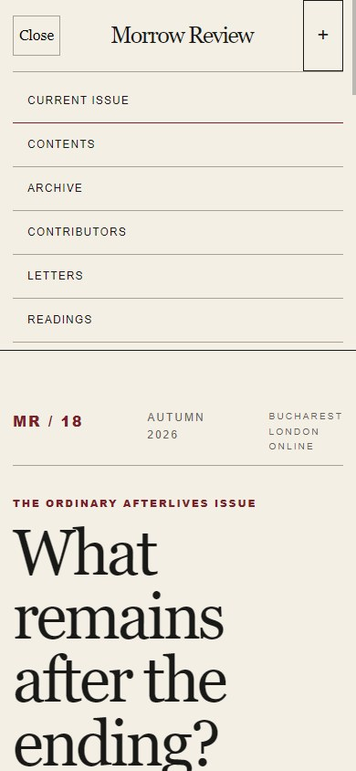</a>
</p>

The transformations remain causally different: the service becomes one evidence order, the operations table becomes structured records with an on-demand rail, and the editorial spread becomes a continuous authored reading flow.

- [Open the rendered forward-tests](benchmarks/forward-tests/README.md)
- [Read the cross-benchmark causal comparison](benchmarks/CROSS-BENCHMARK.md)
- [Inspect the local evidence audit](evals/designer-behavior/EVIDENCE-AUDIT.md)

## What Snowe changes

Snowe gives the agent freedom to invent a solution absent from local patterns, while making that freedom accountable:

- product truth and the whole user journey precede pages and styling;
- high-leverage choices use a causal record: `driver → design move → expected consequence → evidence → risk → revisit trigger`;
- site/page candidates differ in topology, navigation, sequence, disclosure, interaction, or conversion—not only visual tokens;
- art direction is derived from the product's real objects, content, workflow, audience, language, and place;
- external research is targeted at decisions it can change and stops when evidence is sufficient;
- `No image`, `No custom asset`, and `No animation` are valid outcomes;
- generated imagery is art-directed for the actual crop and rejected when it weakens truth or composition;
- custom graphics have a drawing language, provenance, structural validation, target-size comparison, and a rejection path;
- motion starts from a complete static/reduced-motion experience and exists only for hierarchy, continuity, explanation, feedback, or character that earns its cost;
- accessibility, content resilience, responsive behavior, localization, interaction quality, and performance remain design invariants;
- evaluation uses rendered `KEEP | REVISE | REJECT | UNKNOWN` evidence rather than a numeric creativity score.

## How it works

```mermaid
flowchart LR
    A["Product truth"] --> B["Open causal decisions"]
    B --> C["Synthesize experience architectures"]
    C --> D["Prototype risky slices"]
    D --> E["Choose art direction"]
    E --> F["Decide imagery, custom assets, and motion"]
    F --> G["Implementation contract"]
    G --> H["Build in the real repository"]
    H --> I["Wide / pressure / narrow rendered QA"]
    I -->|"material weakness"| B
    I -->|"verified"| J["Evidence-backed delivery"]
```

Snowe scales the inquiry to the consequence:

- **Direct** for a narrow defect or routine state inside a coherent system.
- **Focused** for a material decision inside an established product.
- **Portfolio** for a new product, site, page family, identity, or unresolved high-impact architecture.

Specialist references are loaded only when the decision needs them. A project does not execute every workflow as a checklist.

## Repository structure

```text
snowe-ui-skill/
├── skill/snowe-ui-skill/             # Installable product
│   ├── SKILL.md                       # Core workflow and reference router
│   ├── agents/openai.yaml             # Skill interface metadata
│   ├── data/                          # Optional local evidence catalogs
│   ├── references/                    # Progressive specialist guidance
│   └── scripts/
│       ├── search.py                  # CLI entrypoint
│       ├── core.py                    # BM25 retrieval and evidence roles
│       ├── decision_packet.py         # Open architecture-first inquiry
│       ├── asset_quality.py           # SVG structure/provenance validation
│       └── contrast.py                # Exact opaque-color contrast checks
├── evals/designer-behavior/           # Cross-business behavioral contracts
├── benchmarks/bicycle-commerce/       # Rendered Goodturn forward-test
├── benchmarks/soda-campaign/           # Expressive Doppler motion benchmark
├── benchmarks/forward-tests/           # Public-service, operations, and editorial evidence
├── scripts/browser-smoke.mjs           # Dependency-free Chrome/CDP browser checks
└── tests/                             # Product and benchmark regression suite
```

Repository documentation, evaluations, benchmarks, and development tooling stay outside the installable skill directory.

## Installation

### Codex on Windows

```powershell
git clone https://github.com/What0ff/snowe-ui-skill.git
Copy-Item -Recurse -Force `
  .\snowe-ui-skill\skill\snowe-ui-skill `
  "$env:USERPROFILE\.codex\skills\snowe-ui-skill"
```

### Codex on macOS or Linux

```bash
git clone https://github.com/What0ff/snowe-ui-skill.git
mkdir -p "${CODEX_HOME:-$HOME/.codex}/skills"
cp -R snowe-ui-skill/skill/snowe-ui-skill \
  "${CODEX_HOME:-$HOME/.codex}/skills/snowe-ui-skill"
```

Restart Codex or begin a new task so the skill catalog is refreshed. For another compatible runtime, copy `skill/snowe-ui-skill/` into its skill directory; the folder containing `SKILL.md` is the installable unit.

## Usage

Invoke the skill from a real design/build request:

```text
Use $snowe-ui-skill to design and build a new commerce experience from product truth through rendered QA.

Use $snowe-ui-skill to rethink this service's information architecture and navigation before changing its visual system.

Use $snowe-ui-skill to review this existing product, preserve what works, and fix the most consequential UX and visual-quality failures.
```

The skill can design or critique web, mobile, and desktop experiences; establish site/page architecture and navigation; create art direction and design systems; decide typography, color/material, imagery, custom graphics, icons, motion, interactions, and responsive behavior; implement the result; and run rendered review.

## Local decision support

The Python runtime uses the standard library and makes no network request. Its retrieval results now state their evidence role and limitation.

Search one evidence domain:

```bash
python skill/snowe-ui-skill/scripts/search.py \
  "bicycle fit comparison" --domain product --max-results 5
```

`--domain` is required for catalog retrieval. Current domains are `chart`, `product`, `ux`, `icons`, `icon-families`, `icon-concepts`, `icon-candidates`, `react`, `web`, and `google-fonts`; stack guidance uses the separate `--stack` option.

Open a decision packet without selecting a layout, style, palette, font, image, or motion recipe:

```bash
python skill/snowe-ui-skill/scripts/search.py \
  "Independent city-bike retailer with fit and test rides" \
  --decision-packet \
  --project-name "Goodturn Cycles" \
  --format markdown
```

The packet preserves the brief verbatim. It does not classify brief vocabulary, detect its language, or infer work mode, platform, pressures, or ambiguous domain roles. Those fields remain `UNRESOLVED` unless the caller supplies explicit context; the agent derives pressures later from verified project evidence.

Local product analogs are not retrieved automatically. Request a subordinate lexical lookup only when it can change a live decision:

```bash
python skill/snowe-ui-skill/scripts/search.py \
  "Городской магазин велосипедов с подбором посадки" \
  --decision-packet \
  --analog-query "bicycle retailer fit"
```

Persist the open brief, a durable decision ledger, and an optional page inquiry:

```bash
python skill/snowe-ui-skill/scripts/search.py \
  "Independent city-bike retailer with fit and test rides" \
  --decision-packet --persist \
  --project-name "Goodturn Cycles" \
  --page "home" \
  --output-dir /path/to/project
```

Persistence writes under `design-intelligence/<project>/`: `BRIEF.md` is regenerated from the current packet, `DECISIONS.md` is created only when absent and then preserved, and `--page` adds or refreshes a page inquiry without prescribing a page type or section order.

`--design-system` remains a compatibility alias for `--decision-packet`; it no longer invokes the removed recipe generator. See `python skill/snowe-ui-skill/scripts/search.py --help` for all domains and stacks.

## Optional local evidence

The remaining optional local evidence catalogs include caller-requested product analog terms, Google Fonts metadata, UX and web implementation guidance, chart guidance, stack-specific references, icon families/concepts, and curated icon candidates.

These records can expand vocabulary, reveal alternatives, provide counterexamples, or route current research. They are not product classification, current market truth, conversion proof, or an authoritative list of allowable designs.

Layout, landing, style-combination, palette, typography-pairing, and motion-preset catalogs were removed: even labeled as historical evidence, they encoded ready-made solutions and unsupported suitability claims. Git history preserves the old rows; the installable skill does not return them.

## Evaluation and validation

Run the full regression suite:

```bash
python -m unittest discover -s tests -v
```

Run the cross-business behavior evaluation:

```bash
python evals/designer-behavior/run_eval.py
```

Compile-check the installable runtime:

```bash
python -m compileall -q skill/snowe-ui-skill/scripts
```

Run the dependency-free rendered smoke layer with Node 22 and a local Chrome/Chromium installation:

```bash
node scripts/browser-smoke.mjs --smoke
```

CI runs compile and unit regressions on Python 3.11/3.13 across Ubuntu and Windows, the multilingual/generalization behavior evaluation, and the Chrome smoke.

- Unit tests and the behavioral eval protect runtime, epistemic, packaging, and benchmark contracts; they do not score taste.
- Browser smoke executes the four tested benchmarks and checks for runtime errors, broken assets, horizontal overflow, menu/dialog behavior, focus handoff, critical interactions, responsive states, and reduced-motion regressions.
- Rendered captures, decision records, and QA notes provide comparative evidence for human visual judgment. They do not certify aesthetic quality or universal performance.

## Design principles

- Design the right experience before styling the familiar one.
- Freedom comes from live product trade-offs; coherence comes from causal decisions.
- Current external evidence can expand and challenge the local space without becoming a moodboard or copy target.
- Real content, claims, prices, states, crops, and interactions are part of design—not late implementation detail.
- Familiar actions remain recognizable; novelty belongs where it improves identity, comprehension, or experience.
- Rendered consequence matters more than the number of rules, variants, datasets, or gates.

## Contributing

Contributions are welcome. Read [CONTRIBUTING.md](CONTRIBUTING.md) before submitting a change. Security issues should follow [SECURITY.md](SECURITY.md).

## License

Snowe UI Skill is available under the [MIT License](LICENSE).

Copyright (c) 2026 What0ff.
