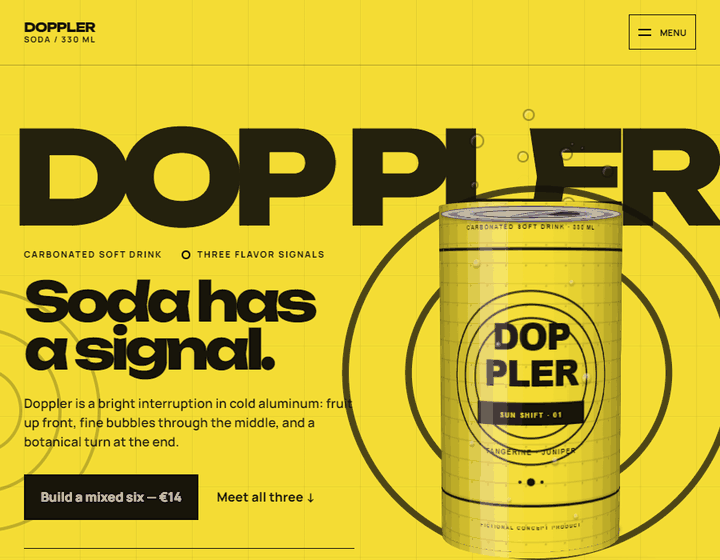
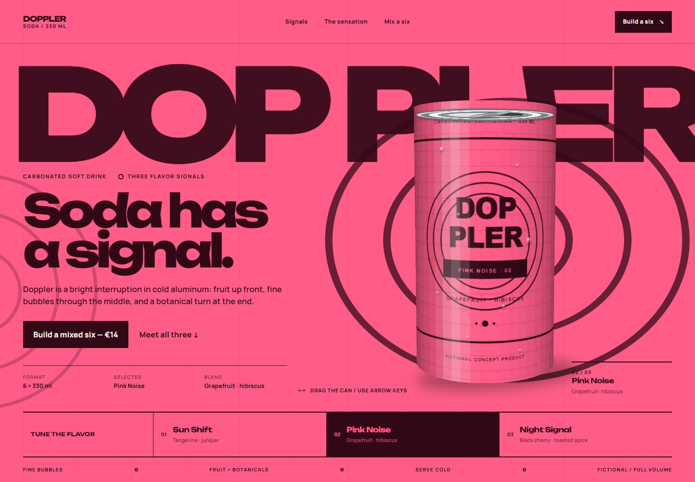
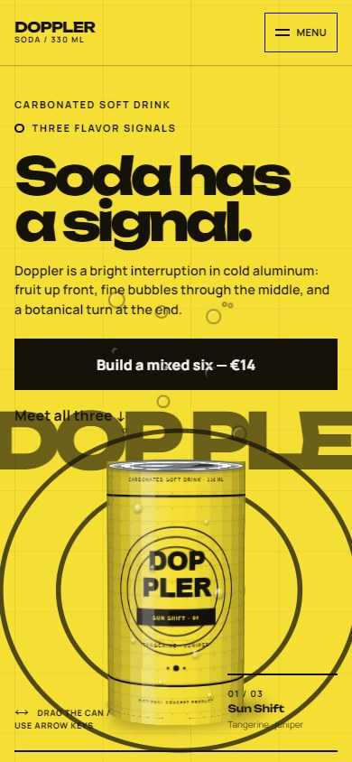

# Doppler Soda — flagship expressive-motion benchmark

Doppler is a fictional carbonated soft-drink campaign created as rendered evidence of Snowe's expressive-motion capability. It is a static, dependency-free HTML/CSS/JavaScript experience: no build, backend, CDN, analytics, or runtime network service is required.



The selected thesis treats carbonation as a moving signal. A segmented CSS-3D aluminum can wraps three original local label textures, enters with a finite pressure release, rotates through direct pointer/keyboard input, and makes a complete physical turn when flavor state changes. Long-form product communication stays still; navigation, selection, and the fictional six-pack confirmation use restrained functional feedback.

| Wide product state | Narrow product state |
| --- | --- |
|  |  |

## Run locally

Serve the repository root so benchmark and evidence links resolve:

```text
python -m http.server 4173 --bind 127.0.0.1
```

Then open `http://127.0.0.1:4173/benchmarks/soda-campaign/`.

Focused screenshots can be regenerated without touching stable benchmark captures:

```text
node scripts/browser-smoke.mjs --capture-soda
```

Raw motion evidence can be recaptured into an explicitly chosen empty temporary directory:

```text
$env:SODA_MOTION_DIR = "<empty-temporary-directory>"
node scripts/browser-smoke.mjs --soda-motion-frames
```

That command records 72 live browser PNGs and does not overwrite the checked-in optimized GIF or establish an image-encoder runtime dependency.

The executable smoke is:

```text
node scripts/browser-smoke.mjs --smoke
```

## Evidence

- [Open the implementation](index.html)
- [Read the brief](design-intelligence/BRIEF.md)
- [Compare architecture, art-direction, and motion candidates](design-intelligence/CANDIDATES.md)
- [Read accepted decisions](design-intelligence/DECISIONS.md)
- [Read motion architecture](design-intelligence/MOTION.md)
- [Inspect asset provenance](design-intelligence/ASSETS.md)
- [Inspect rendered QA and corrections](design-intelligence/QA.md)
- [Browse screenshots and the browser-captured preview](screenshots)

## Disclosure

Doppler, its packaging, blends, price, copy, and commercial terms are fictional concept content. The can, label textures, signal graphics, and pack graphics are original code-native assets. No AI-generated imagery is used. The GIF and stills were captured from the final browser implementation; they are evidence, not separately fabricated product art. No order or payment is processed.
